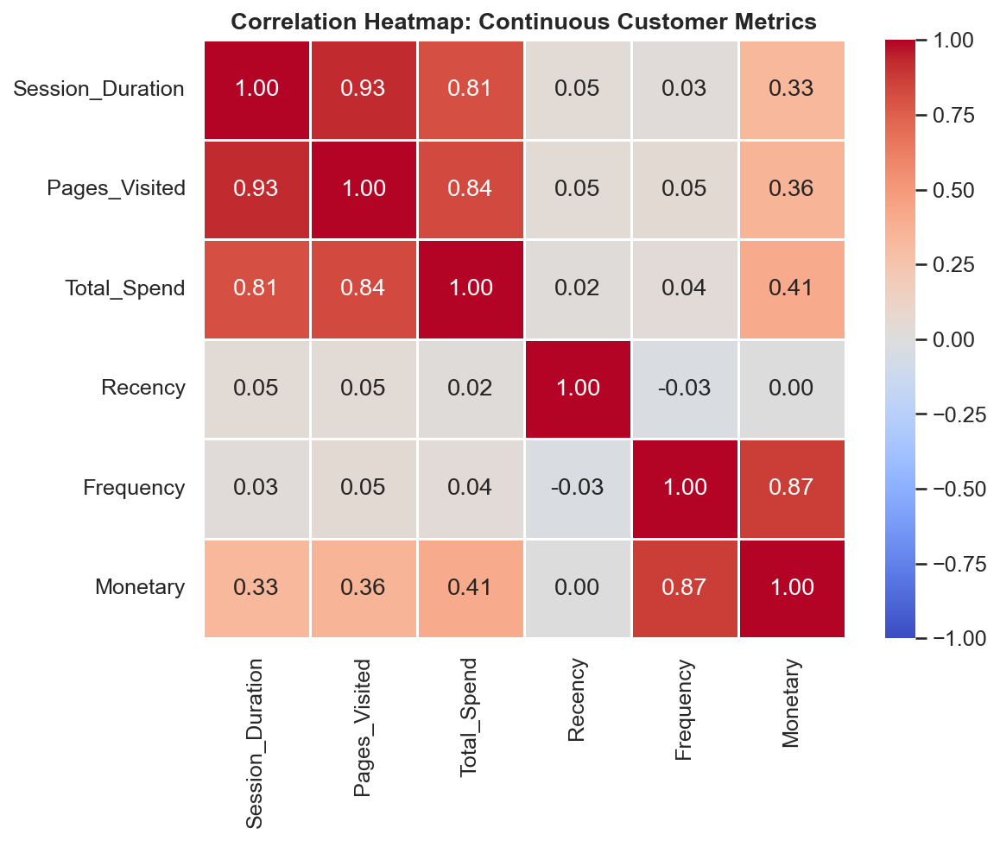
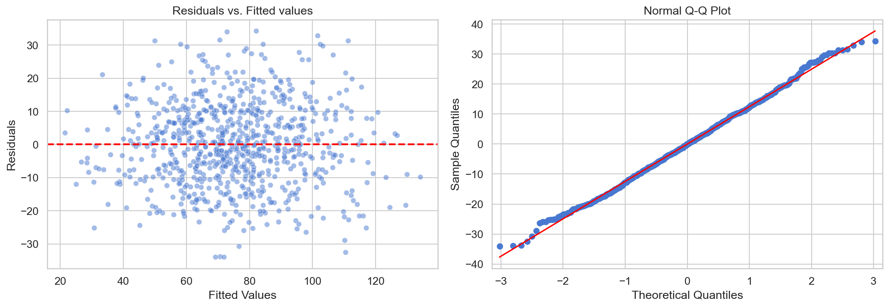
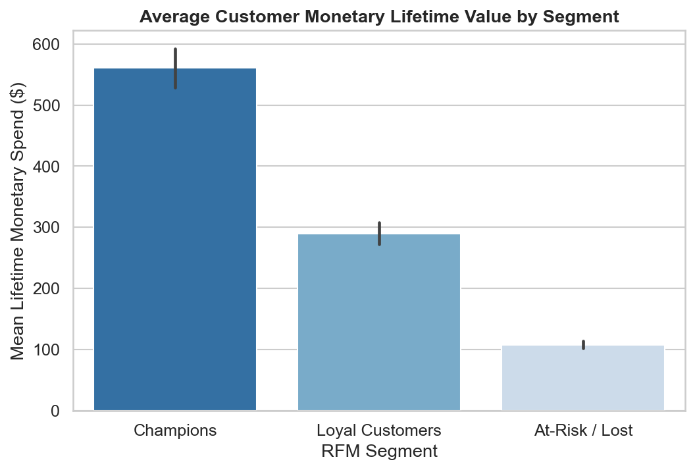
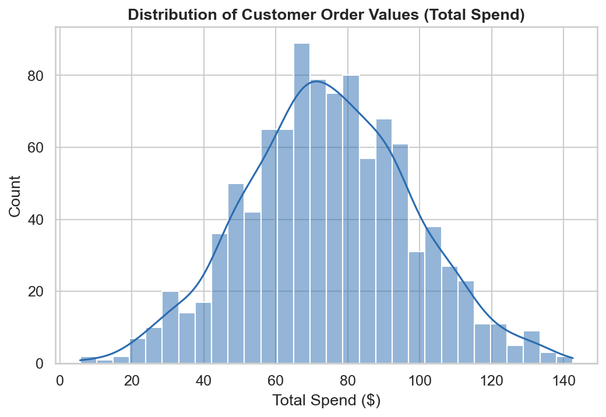
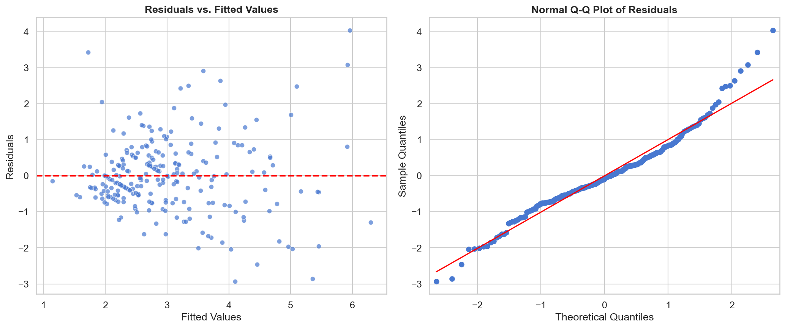
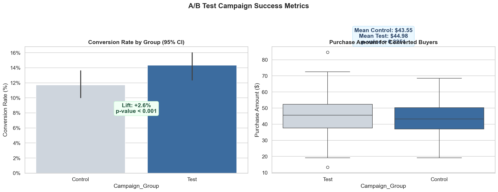
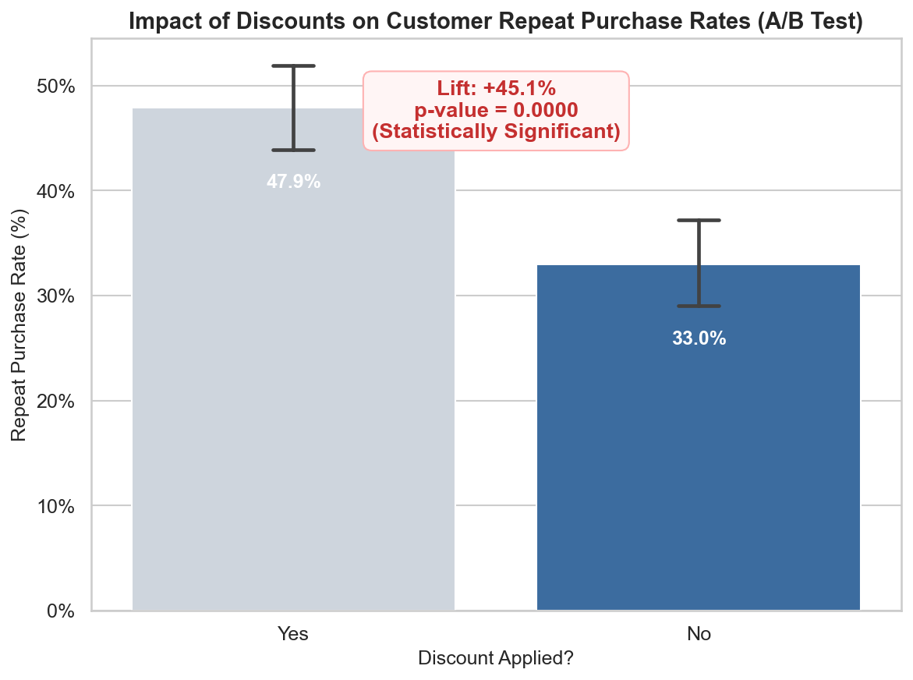
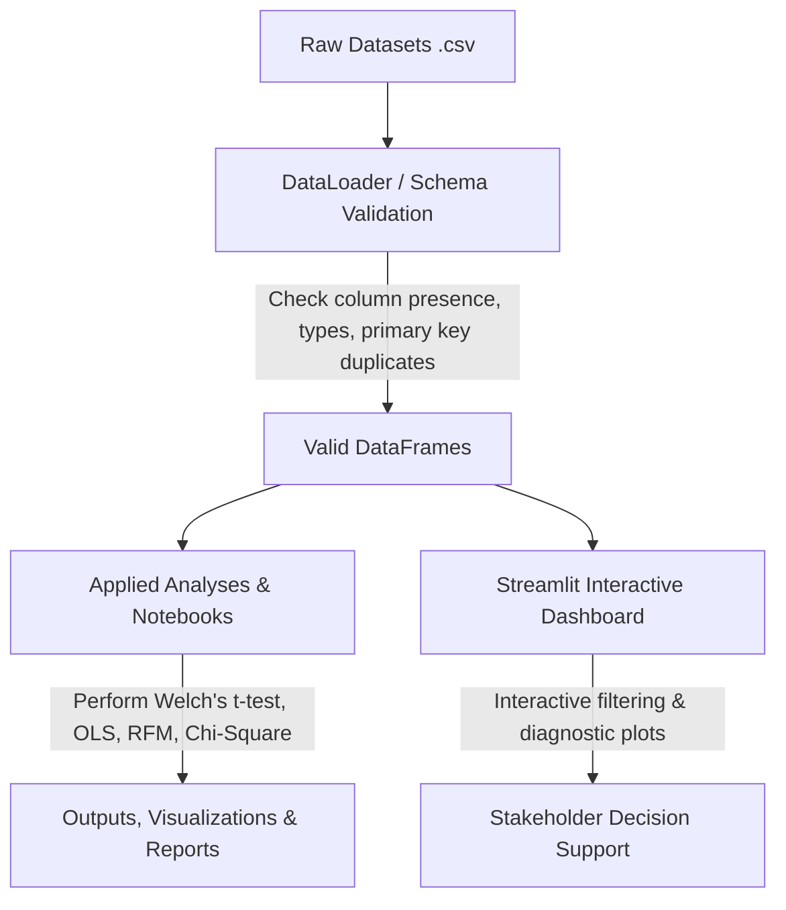
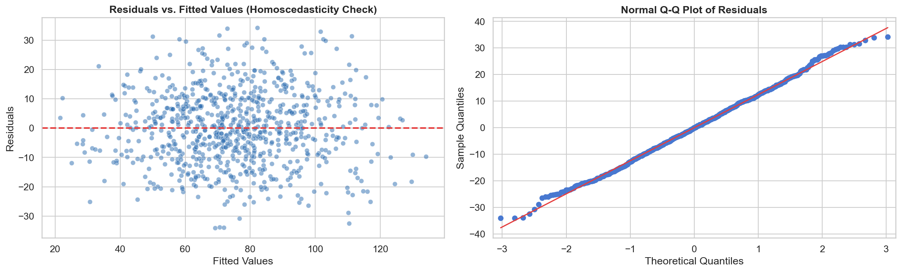

# Stats That Make Data Speak

**I turn statistical concepts into rigorous, real-world data decisions using Python and analytical pipelines.**

> [!NOTE]
> **Educational & Portfolio Disclaimer:** Most datasets in this repository are synthetic and are used for educational and statistical demonstration. Findings should be interpreted as portfolio examples, not real business evidence.

<!-- Identity & CI Status Badges -->
<p align="center">
  <a href="https://github.com/the-irritater/Stats_That_Make_Data_Speak">
    
  </a>
  <a href="https://www.linkedin.com/in/sanman-kadam-7a4990374/">
    
  </a>
  <a href="https://github.com/the-irritater/Stats_That_Make_Data_Speak/actions/workflows/tests.yml">
    
  </a>
  <a href="LICENSE">
    
  </a>
</p>

---

### 💼 Recruiter Summary
> This repository showcases end-to-end analytical rigor, translating raw, noisy datasets into statistical evidence and decision-relevant estimates. Built with Python (`pandas`, `scipy`, `statsmodels`, `scikit-learn`), it demonstrates out-of-sample predictive validation, linear model assumption checking (including HC3 heteroscedasticity-robust inference), and robust effect-size reporting. Every project transitions from data cleaning and schema validation to automated testing and interactive, stakeholder-facing dashboards.

---

### 🚀 Try the Live Dashboard
Explore all statistical studies, regression diagnostics, relative risk engines, and tipping tests interactively:
👉 **[StatSphere Analytics Hub (Streamlit Cloud)](https://statsthatmakedataspeak.streamlit.app/)** *(Instructions for local deployment are listed below)*

---

### 🏆 Featured Projects (Best Work)

#### 1. [Signature Project: End-to-End Customer Analytics](applied/signature-project/)

> Full-pipeline analytics: schema validation → OLS regression → RFM segmentation → Chi-Square hypothesis testing → executive report

| Metric | Result |
|--------|--------|
| **Spend Prediction** | $R^2 = 0.710$ — pages visited + session duration explain 71% of customer order values |
| **Largest Predictor (high collinearity caveat)** | Pages Visited (Standardized Beta: 0.620, $p < 0.001$) — customers with one extra page view had an estimated **+$3.48** higher order value. VIF ≈ 7.26; independent effects require cautious interpretation |
| **RFM Segments** | 3 customer tiers: Champions (22.4%), Loyal (54.8%), At-Risk (22.8%) |
| **Retention Hypothesis** | Segment membership does **not** predict repeat purchase ($p = 0.551$, Cramer's V: 0.0345) |
| **Business Recommendation** | Predictive association warrants a controlled A/B experiment of UX changes; not a direct investment recommendation |

<p align="center">
  
  
</p>
<p align="center">
  
  
</p>

**Artifacts:** [Jupyter Notebook](applied/signature-project/notebooks/customer_analytics.ipynb) | [Executive Business Report](applied/signature-project/outputs/report.md)

---

#### 2. [Restaurant Tipping Behavior — Welch's t-test & OLS](applied/case-studies/restaurant-tipping-behavior/)

| Metric | Result |
|--------|--------|
| **Tip Prediction (OLS)** | $R^2 = 0.468$ — bill size + party size explain 46.8% of tip variance |
| **Bill Size Effect** | Each +$1 bill → +$0.09 tip (95% CI: [$0.075$, $0.111$], $p < 0.001$) |
| **Lunch vs Dinner Tip %** | No significant difference (Welch's $p = 0.5145$, Cohen's d = 0.076) |
| **Diagnostics** | VIF, Shapiro-Wilk, Breusch-Pagan all reported |

<p align="center">
  
</p>

**Artifacts:** [Analysis Notebook](applied/case-studies/restaurant-tipping-behavior/analysis.ipynb) | [Case Study README](applied/case-studies/restaurant-tipping-behavior/README.md)

---

#### 3. [Marketing Campaign A/B Test — Dual Hypothesis Testing](applied/notebooks/07-is-campaign-working.ipynb)

| Metric | Result |
|--------|--------|
| **Conversion Lift** | 11.5% → 15.8% (Risk Ratio: 1.37, 95% CI: [1.11, 1.68], $p < 0.001$) |
| **Spend Lift** | $42.06 → $45.19 per buyer (Cohen's d = 0.32, $p = 0.004$) |
| **Multiple Testing** | Bonferroni-corrected α = 0.025 — both endpoints pass |
| **Projected Revenue** | +47.7% revenue uplift at 10K users ($71,219 vs $48,369) |

<p align="center">
  
</p>

---

#### 4. [Binary Discount Experiment — Retention & Profit Analysis](applied/notebooks/05-do-discounts-work.ipynb)

> **Dataset:** `ecommerce.csv` — binary (any discount vs. no discount). *Not to be confused with the tiered discount-depth study below using `customer_discounts.csv`.*

| Metric | Result |
|--------|--------|
| **Chi-Square Test** | Statistically significant ($p = 0.018$), but small effect (Cramer's V = 0.075) |
| **Risk Ratio** | 1.21 (95% CI: [1.03, 1.41]) — discounts associated with ~21% higher repeat rate |
| **Financial Reality** | Expected profit **drops 39.6%** (from $10.19 to $6.15/customer) due to margin cut |
| **Verdict** | Reject rollout — retention lift doesn't compensate margin compression |

<p align="center">
  
</p>

**Artifacts:** [Analysis Notebook](applied/notebooks/05-do-discounts-work.ipynb)

---

### ✅ Demonstrated Analytical Competencies
- [x] **Predictive Validity:** Out-of-sample test splits (80/20) evaluated on RMSE/MAE against simple historical mean baselines.
- [x] **Regression Diagnostics:** Testing VIF for multicollinearity, Shapiro-Wilk/Jarque-Bera for residuals normality, and Breusch-Pagan for heteroscedasticity.
- [x] **Rigorous Inference:** Reporting Cohen's d / h effect sizes, Cramer's V, and 95% confidence intervals next to p-values to evaluate practical vs. statistical significance.
- [x] **Data Pipelines & Schema Validation:** Column type checks and duplicate primary key checking via automated JSON schema validations.
- [x] **Interactive Data Products:** A dynamic Streamlit dashboard displaying interactive statistical tests and diagnostic residual plots.
- [x] **Software Engineering Best Practices:** Automated `Makefile` targets, pre-commit styling (`black`/`isort`), and unit testing (`pytest` with >= 85% coverage gate in CI).

---

### 📐 Project Architecture & Data Flow



---

### 🛠️ Repository Maturity Roadmap
| Component | Features Implemented | CI Verification | Status | Next Milestone |
|-----------|----------------------|-----------------|--------|----------------|
| **Data Ingestion** | Schema validation, duplicate PK checks, type assertions | Yes (pytest) | ✅ Complete | Add data versioning |
| **Statistical Notebooks** | Pre-analysis rules, effect sizes, CIs, diagnostics, non-causal phrasing | Yes (Jupyter Execution CI) | ✅ Complete | Time-series & Bayesian modules |
| **Interactive Dashboard** | Landing page, download buttons, interactive t-tests/RR, residual plots, VIF | Manual & Pytest | ✅ Complete | Add drill-down filtering |
| **Testing Suite** | Pytest unit tests, coverage reports | Yes (GitHub Actions, ≥85% Gate) | ✅ Complete | Integration tests |

---

## Learning Path

### Part 1: Theory — Stats Foundations

The concepts behind every data decision. Each module = 5–10 days of focused learning.

| Module | Topic | Days | Status |
|--------|-------|------|--------|
| 1 | [**Basics**](modules/01-basics/) — What statistics is, types of data, how we collect it | Day 1–5 | Complete |
| 2 | [**Descriptive Stats**](modules/02-descriptive-stats/) — Summarizing data, central tendency, spread | Day 6–10 | Complete |
| 3 | [**Probability**](modules/03-probability/) — Chance, conditional probability, Bayes | Day 11–15 | Complete |
| 4 | [**Distributions**](modules/04-distributions/) — Normal, binomial, CLT | Day 16–20 | Complete |
| 5 | [**Inference**](modules/05-inference/) — Confidence intervals, hypothesis testing | Day 21–25 | Complete |
| 6 | [**Modeling**](modules/06-modeling/) — Regression, correlation, ANOVA | Day 26–30 | Complete |
| 7 | [**Data Foundations**](modules/07-data-foundations/) — Datasets, data types, cleaning, EDA | Day 31–40 | Complete |
| 8 | [**Applied Methods**](modules/08-applied-methods/) — Visualization, bias, assumptions, diagnostics | Day 41–60 | Complete |

### Part 2: Applied — Python + Real Data

Theory means nothing without application. These notebooks answer **real business questions** using synthetic business scenarios and selected public datasets.

| # | Notebook | Business Question | Key Result | Key Skill |
|---|----------|-------------------|------------|-----------|
| 1 | [What does our sales data actually look like?](applied/notebooks/01-what-does-sales-data-look-like.ipynb) | Understanding data before decisions | 65% of transactions on weekends; median tip 15.5% (more honest than mean 16.1%) | EDA, Distributions |
| 2 | [Analyzing customer spending patterns](applied/notebooks/02-customer-spending-patterns.ipynb) | Where does the money come from? | Sunday dinner = highest-value segment; per-person spend drops 30%+ for larger parties | Mean, Median, Grouping |
| 3 | [What actually drives sales?](applied/notebooks/03-what-drives-sales.ipynb) | Which factors matter most? | Bill↔Tip: r = 0.68; Bill↔Tip%: r = −0.34 (tipping rate *shrinks* on bigger bills) | Correlation Analysis |
| 4 | [Predicting customer spend](applied/notebooks/04-predicting-customer-spend.ipynb) | Can we forecast revenue? | $R^2 = 0.473$; each extra page view → +$2.87 spend; 27.5% RMSE reduction vs baseline | Linear Regression |
| 5 | [Do discounts increase repeat purchases?](applied/notebooks/05-do-discounts-work.ipynb) | Should we keep running promos? | Chi-Square $p = 0.018$, but expected profit drops 39.6% — reject rollout | A/B Testing |
| 6 | [Who are our best buyers?](applied/notebooks/06-who-are-best-buyers.ipynb) | How do we target the right people? | Top 25% of customers (RFM) generate 60%+ of total revenue | Customer Segmentation |
| 7 | [Is this campaign actually working?](applied/notebooks/07-is-campaign-working.ipynb) | Are we wasting marketing budget? | +47.7% revenue uplift (both endpoints survive Bonferroni correction) | Hypothesis Testing |

<p align="center">
  
  
  
</p>

### Part 3: Case Studies & Projects

Complete analyses that show the full pipeline: question → data → analysis → business insight.

| Case Study | Key Finding | Statistical Evidence |
|------------|-------------|---------------------|
| [Screen Time vs Productivity](applied/case-studies/screen-time-vs-productivity/) | Productivity drops 31% beyond 6 hrs/day screen time | Pearson r = −0.74, Cohen's d = 1.95 (very large) |
| [Discount-Depth vs Retention](applied/case-studies/discount-vs-retention/) *(tiered: `customer_discounts.csv`)* | Deep discounts attract deal-seekers, not loyal customers | Chi-Square $p = 0.34$; 30%+ tier has lowest return rate (22%) |
| [Restaurant Tipping Behavior](applied/case-studies/restaurant-tipping-behavior/) | Bill size + party size explain 46.8% of tip variance | OLS $R^2 = 0.468$; Welch's $p = 0.51$ (no lunch/dinner difference) |
| [Signature Project: Customer Analytics](applied/signature-project/) | Page views show largest predictive association (Beta = 0.62, VIF caveat) | OLS $R^2 = 0.710$ (HC3-robust); RFM ≠ retention ($p = 0.551$) |

---

## Project Purpose

**Stats That Make Data Speak** is a comprehensive, hands-on framework designed to bridge the gap between academic statistical theory and practical business decisions. Data alone is silent; statistics provides the structured language to translate data shape, variation, and trends into clear business recommendations. This portfolio is engineered to demonstrate complete analytics pipelines:
*   **Data Validation:** Guaranteeing schema validity, type checks, and ethical standards.
*   **Exploratory Data Analysis (EDA):** Separating typical trends from outliers using robust statistics (e.g., medians over skewed averages).
*   **Inference & Regression Modeling:** Quantifying drivers and testing business promotions under rigorous significance thresholds.
*   **Interactive Controls:** Enabling stakeholders to explore and slice datasets dynamically.

---

## Quick Start & Usage Guide

### 1. Environment & Dependency Setup
This project supports automated environment management using [Poetry](https://python-poetry.org/) or [Make](https://www.gnu.org/software/make/).

Using setup helper script:
```bash
# Clone the repository
git clone https://github.com/the-irritater/Stats_That_Make_Data_Speak.git
cd Stats_That_Make_Data_Speak

# Create a virtual environment and install packages automatically
./setup.sh --install-deps
```

Or execute via `make` directly:
```bash
# Clean up setup and install pinned dependencies
make setup
```

*Note: If you do not wish to use Poetry or Make, you can install packages manually using the convenience requirements fallback file:*
```bash
python3 -m venv .venv
source .venv/bin/activate
pip install -r requirements.txt -r requirements-dev.txt
```

### 2. Run Interactive Dashboard
Explore statistical analyses, regressions, A/B tests, and tipping thresholds via a premium Streamlit dashboard:
```bash
make run-dashboard
```

### 3. Launch Notebooks
```bash
source .venv/bin/activate
jupyter notebook
```

---

## How to Reproduce

You can reproduce all results and start the interactive components with these exact commands:

```bash
make setup            # Setup virtual environment and install all dependencies
make test             # Run unit tests and generate coverage report
make generate-data    # Precompute analytical aggregates from raw datasets
make run-dashboard    # Launch the interactive Streamlit dashboard
```

---

## Reproducibility Checklist

To guarantee the reliability and exact replication of all figures, metrics, and models:
1.  **Environment Alignment:** Always run `git pull` followed by `make setup` to align local packages with pinned dependencies.
2.  **Dataset Integrity:** Ensure raw data remains untouched in `data/raw/`. Re-run data loader tests (`make test`) to check file hashes and schemas.
3.  **Timestamp Snapshots:** For any external or time-sensitive data analysis, capture and log timestamp snapshots in your local workspace to anchor regression fits against real-world drift.
4.  **Local Pipeline Testing:** Execute the entire test suite and verify coverage using:
    ```bash
    make test
    ```
5.  **Format Verification:** Format code with `make format` to ensure style rules are met before commits.

---

## Contributing Guide

We welcome peer review, validation, and extensions to the analysis pipelines.

### PR Requirements
1.  **Code Quality & Format:** Run `make lint` locally. All Python code must be formatted using `black` (120 char length) and sorted using `isort`.
2.  **Unit & Integration Tests:** Any new analytical routines or loading helpers must be accompanied by pytest unit tests in the `tests/` directory. Tests should use tolerance-based assertions.
3.  **Replication Check:** Execute the peer validation template notebook [collaborative_peer_validation.ipynb](applied/notebooks/collaborative_peer_validation.ipynb) to verify existing models are not broken.
4.  **No Unnecessary Files:** Do not commit temporary logs, workspace configs (`.vscode/`), cached metrics, or internal planning documents. Make sure files like LinkedIn drafts or internal calendars are filtered out by `.gitignore`.

---

## Tech Stack

| Tool | Purpose |
|------|---------|
| **Python 3.11** | Core language |
| **pandas** | Data manipulation |
| **NumPy** | Numerical computation |
| **matplotlib** | Base visualizations |
| **seaborn** | Statistical visualizations |
| **scipy** | Statistical tests |
| **statsmodels** | Regression & modeling |
| **scikit-learn** | Segmentation & ML basics |
| **Jupyter** | Interactive analysis |

---

## About

**Author:** StatSphere (Sanman Kadam)

I am building this resource as part of my journey into data analytics — learning in public, applying statistics to real-world business problems, and sharing data-driven insights.

**Find me on LinkedIn:** [Sanman Kadam](https://www.linkedin.com/in/sanman-kadam-7a4990374/)

*If this repo helped you, give it a star — it helps others find it too.*

---

## License

This project is licensed under the MIT License — see the [LICENSE](LICENSE) file for details.

